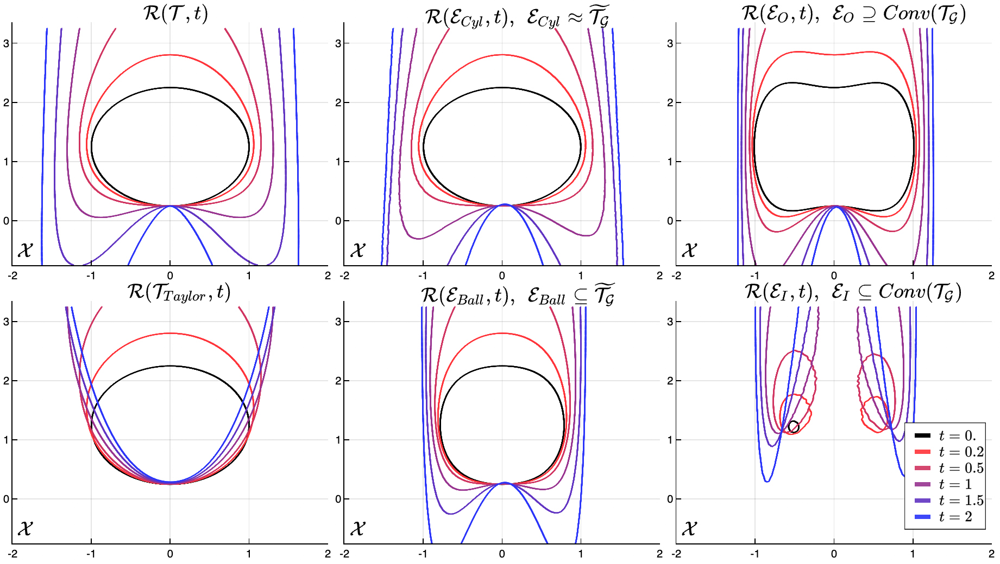
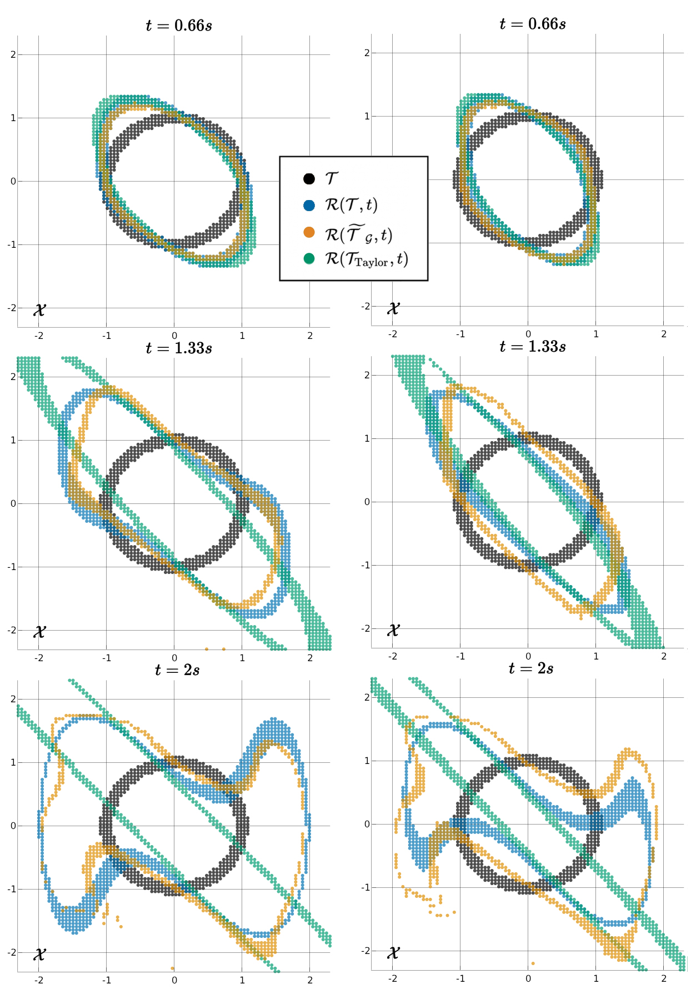
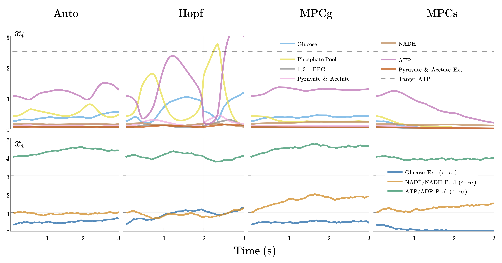

# Koopman-Hopf Reachability 

Here we pair Koopman theory with the Hopf solution for approximate reachability and robust control, associated with this paper https://arxiv.org/abs/2303.11590. This involves using a high-dimensional linear system to approximate the nonlinear differential game to solve approximate Backwards Reachable Sets (see [Slow Manifold Target & BRS Comparison](./SlowManifold_Contours.jpg), [Duffing BRS Comparison](./Duffing_BRS.jpg)) and the corresponding optimal controls (see [Glycolysis Control Comparison](./Glycolysis_Control_Comparison_Sample.png)).

We generate and load Koopman models from [PyKoopman](https://github.com/dynamicslab/pykoopman) and [AutoKoopman](https://github.com/EthanJamesLew/AutoKoopman) and use our [HopfReachability](https://github.com/UCSD-SASLab/HopfReachability) codebase to solve the Hopf solution. Note, this (nontrivially) requires defining a target in the lifted space that corresponds to the true target set (see paper).

The demos are limited to lifting with the identity function (Dynamic Mode Decomposition) and a Polynomial basis as they satisfy requirements for the Hopf problem (see paper) but also because they yielded solid results. Check back for future work with more complicated lifting procedures involving NN's, RBF's, RFF's etc.

Comparison of Lifted Targets & Resulting BRS Approximation in the Slow Manifold System,

Comparison of Convex and Non-convex Hopf BRS for Polynomial Lift in the Duffing System,

Koopman-Hopf versus two Koopman-MPC's in the 10D Glycolysis System,

