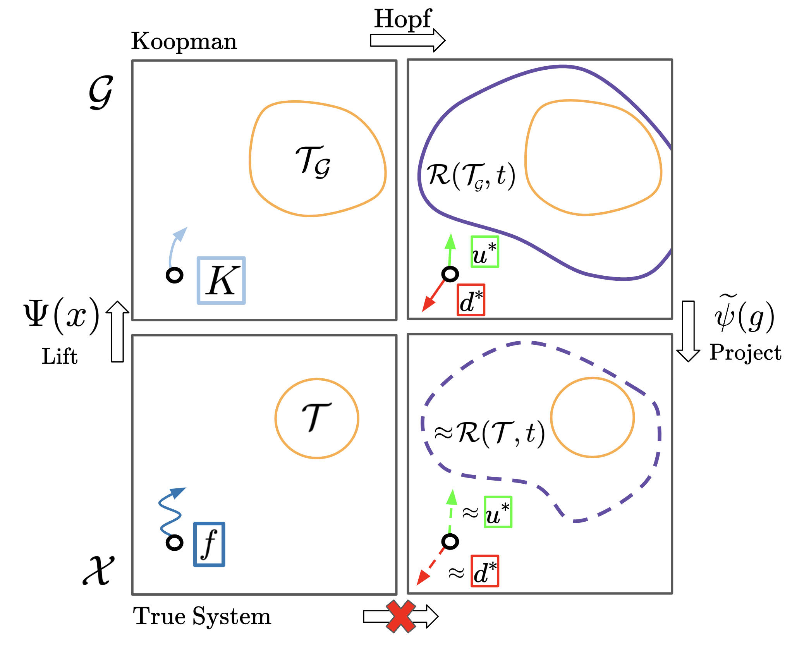
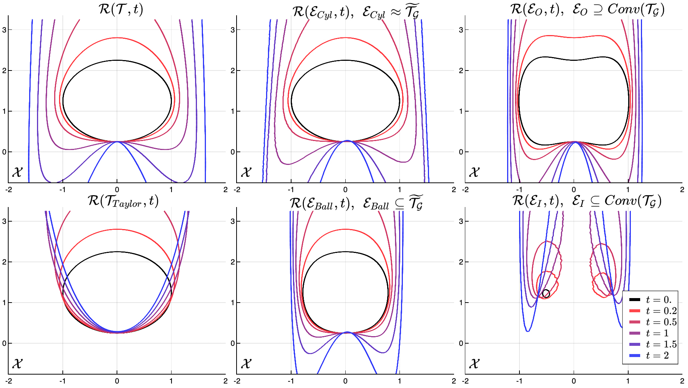
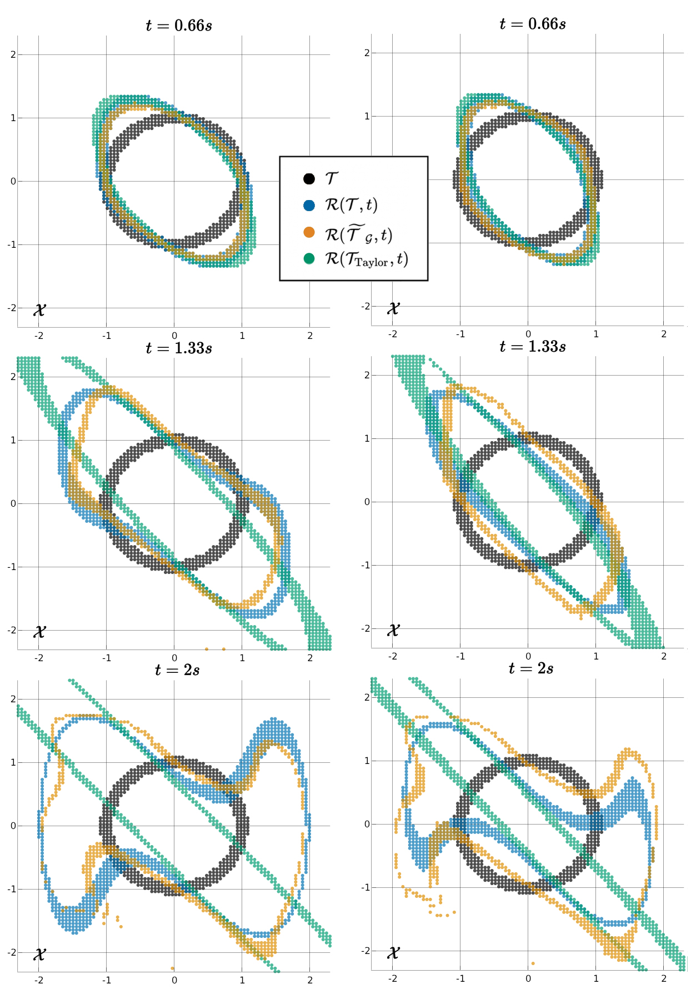
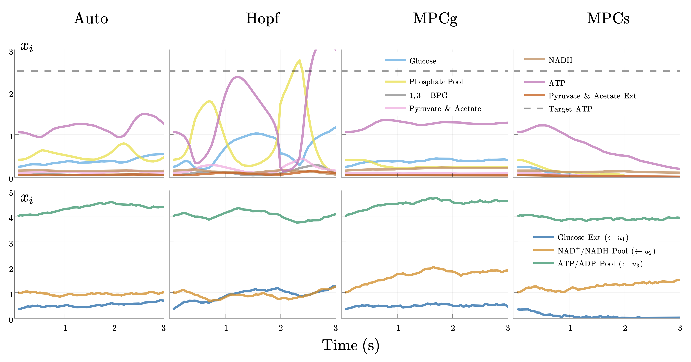

# Koopman-Hopf Reachability 

Here we pair Koopman theory with the Hopf solution for approximate reachability and robust control, associated with this paper https://arxiv.org/abs/2303.11590. This involves using a high-dimensional linear system to approximate the nonlinear differential game to solve approximate Backwards Reachable Sets (see [Slow Manifold Lifted Target Comparison](./SlowManifold_Target_Comparison.jl), [Duffing Game Convexity Comparison](./Duffing_BRS_Comparison.jl)) and the corresponding optimal controls (see [Glycolysis Control Comparison Sample](./Glycolysis_Control_Comparison.jl)). See [exact Hopf comparison](./Exact_Koopman_test.jl) and [exact_DP comparison](./Exact_Koopman_test_hj_reachability.ipynb) for demonstration that without Koopman error both Hopf and Dynamic-Programming methods produce the same solution.

  

We generate and load Koopman models from [PyKoopman](https://github.com/dynamicslab/pykoopman) and [AutoKoopman](https://github.com/EthanJamesLew/AutoKoopman) and use our [HopfReachability](https://github.com/UCSD-SASLab/HopfReachability) codebase to solve the Hopf solution. Note, this (nontrivially) requires defining a target in the lifted space that corresponds to the true target set and convexity of the problem has important implications (see paper). We use the Dynamic-Programming method, [hj_reachability](https://github.com/StanfordASL/hj_reachability), for ground truth comparison when feasible (dimension < 6).

Currently, the demos are limited to lifting with the identity function (Dynamic Mode Decomposition) and a Polynomial basis as they satisfy requirements for the Hopf problem (see paper). Check back for future work with more complicated lifting procedures involving NN's, RBF's, RFF's etc.

## Examples

Slow Manifold Lifted Target Comparison,

  

Duffing Game Convexity Comparison,

  

Glycolysis Control Comparison,

  

