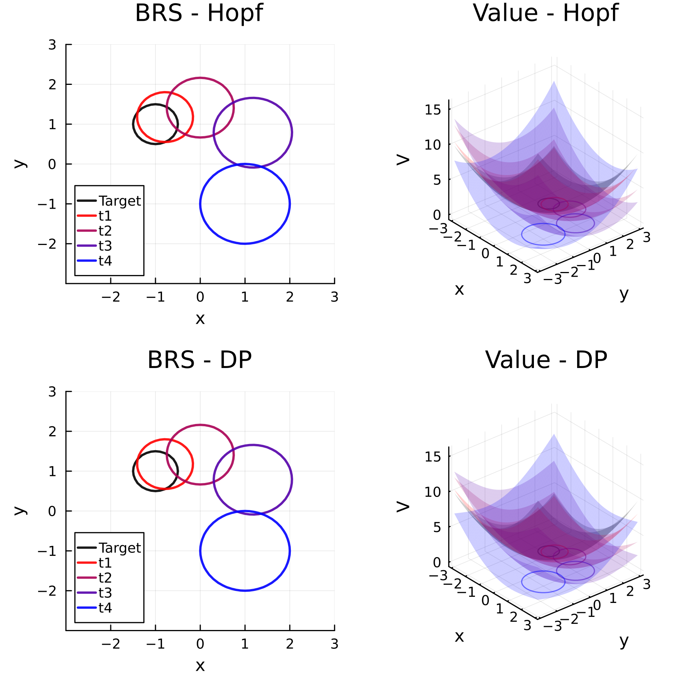

# HopfReachability.jl
Julia code for solving Hamilton-Jacobi optimal control and reachability of differential games via optimization of the Hopf formula. This method allows for solving the value function in a space-parallelizeable fashion that avoids the curse of dimensionality (i.e. one can query the value at any point in space and time alone).

In comparison with differential inclusions ([`ReachabilityAnalysis.jl`](https://github.com/JuliaReach/ReachabilityAnalysis.jl)), which overapproximate all dynamically feasible trajectories, Hamilton-Jacobi Reachability is based on assuming a differential game and yields the reachable set for an optimal controller despite any action of the antagonistic disturbance. See [`hj_reachability.py`](https://github.com/StanfordASL/hj_reachability) or [`helperOC.m`](https://github.com/HJReachability/helperOC) for dynamic programming (dimension-sensitive) solutions to this problem.


Note, **this package and its algorithms are in the early stages of development**. The authors (Will Sharpless, Yat Tin Chow, Sylvia Herbert) welcome any criticism or discovery of bugs. If you are interested in helping, we have many ideas to advance this package and look forward to collaboration.

## Problem Formulation

Consider a control-affine system, such as
```math
\dot{x} = A(t)x + B_1(t) u + B_2(t) d \qquad \text{or} \qquad \dot{x} = f_x(x, t) + h_1(x, t) u + h_2(x, t) d,
```
in which control and disturbance are constrained to compact, convex sets, e.g., 
```math
u \in \big\{ u \in \mathbb{R}^{n_u} \:\: | \:\: (u-c_u (t))^T Q^{-1}_u (t) (u-c_u (t)) \leq 1 \big\} \quad \& \quad d \in \big\{d \in \mathbb{R}^{n_d} \:\: | \:\: (d-c_d (t))^T Q^{-1}_d (t) (d-c_d (t)) \leq 1 \big\}.
```
This package allows the computation of the Backwards Reachable Set $\mathcal{R}$ for initial time $t_i$ (via `Hopf_BRS`) defined by
```math
\mathcal{R}(\mathcal{T}, t_i) \triangleq \{ x \mid \forall d(\cdot) \in \mathcal{D}, \exists u^*(\cdot) \in \mathcal{U} \quad \text{s.t.} \quad \xi(t_i) = x, \xi(t_f) \in \mathcal{T} \}
```
where $\xi$ is the system trajectory starting and $\mathcal{T}$ is a user-defined target (to reach or avoid). Informally, this is the set of states that can be driven to the target despite any disturbance in $\mathcal{D}$. Additionally, this package can rapidly compute the optimal control policy $u^*(\cdot)$ to achieve this (either via `Hopf_minT` or `Hopf_BRS`). 

The target set is defined by an initial Value function $J(x)$ for a set $\mathcal{T}$ such that,
```math
J(x) \triangleq \begin{cases}
J(x) \le 0 \:\: \text{ for } \:\:x \in \mathcal{T} \\
J(x) > 0 \:\: \text{ for } \:\:x \notin \mathcal{T}
\end{cases}
```
E.g. An elliptical target yields,
```math
\mathcal{T} \triangleq \big\{x \in \mathbb{R}^{n_x}  \:\: | \:\: (x - c_\mathcal{T})^T Q^{-1}_\mathcal{T} (x - c_\mathcal{T}) \le 1 \big\} \rightarrow J(x) = \frac{1}{2} \big((x - c_\mathcal{T})^T Q^{-1}_\mathcal{T} (x - c_\mathcal{T}) - 1 \big)
```

## Limitations

Alone, the Hopf formula is only guaranteed to yield the correct value [1] when the system is linear & the target is convex. For nonlinear systems, safe linearization methods [2] must be employed (`cons_lins_utls.jl`) and these can be further improved by safe lifting methods [3]. Beware, when the Hamiltonian is non-convex, the Hopf formula gives the correct value, however, the optimization problem becomes non-convex and special solvers guaranteed to solve this problem (e.g. ADMM) must be employed. 

### Associated Publications

1. [Algorithm for Overcoming the Curse of Dimensionality for State-dependent Hamilton-Jacobi equations](https://arxiv.org/pdf/1704.02524.pdf)

2. [Conservative Linear Envelopes for Nonlinear, High-Dimensional, Hamilton-Jacobi Reachability](https://arxiv.org/abs/2403.14184)

3. [State-Augmented Linear Games with Antagonistic Error for High-Dimensional, Nonlinear Hamilton-Jacobi Reachability](https://arxiv.org/abs/2403.16982)

4. [Koopman-Hopf Hamilton-Jacobi Reachability and Control](https://arxiv.org/abs/2303.11590)

## Code Structure

- `Hopf_BRS`: fed a `system`, `target` and time array and an array of states (or can make a grid for you) and solves the value at those states and optimal control
- `Hopf_cd`/`Hopf_admm`: do the optimization
- `Hopf`: gives the value of the Hopf objective for a given value of x and p.
- `Hopf_minT`: finds the minimum time such that a given state is reachable and returns the optimal control
- `preH`, `intH`, `HJoc`: utility fn's for precomputing the Hamiltonian, integrating the Hamiltonian, and solving the optimal control respectivley

## Demo

Here we solve the Backwards Reachable Sets for a simple, time-varying system with an ball target (L2) and inputs confined to boxes (Linf). Note, when solving the BRS, the value at each point is determined independently and then the zero-level set is interpolated after. The plot below shows the comparison with `hj_reachability.py`, a dynamic-programming method.

```julia
include(pwd() * "/src/HopfReachability.jl");
using .HopfReachability: Hopf_BRS, plot_nice, make_grid, make_levelset_fs, make_set_params
using LinearAlgebra, Plots, OrdinaryDiffEq

## Times to Solve
th, Th, Tf = 0.05, 0.25, 1.0
T = collect(Th : Th : Tf)

## Time-Varying Systems
Af(t) = -2 * (Tf - t) * [0. float(pi); -float(pi) 0.]                                           
B₁, B₂ = [1. 0; 0 1], [1. 0; 0 1];

max_u, max_d, input_center, input_shapes = 0.75, 0.25, zeros(2), "ball"
Q₁, c₁ = make_set_params(input_center, max_u; type=input_shapes) # control set 
Q₂, c₂ = make_set_params(input_center, max_d; type=input_shapes) # disturbance set

game = "reach" # try 'avoid' for an avoid game
system_f = (Af, B₁, B₂, Q₁, c₁, Q₂, c₂)

## Target
center, radius = [-1.; 1.], 0.5
J, Jˢ = make_levelset_fs(center, radius; type="ball")
target = (J, Jˢ, (diagm([1; 1]), center));

## Points to Solve
bd, res, ϵ = 3, 0.1, .5e-7
Xg, xigs, (lb, ub) = make_grid(bd, res, size(A)[1]; return_all=true, shift=ϵ);

## Solve & Plot
solution_f, run_stats = Hopf_BRS(system_f, target, T; th, Xg, input_shapes, game);
plot(solution_f; xigs=xigs, value=true)
```
Then we can use `PyCall` to solve the same problem with `hj_reachability.py` (see [Examples/ltv.jl](https://github.com/UCSD-SASLab/HopfReachability/blob/main/Examples/ltv.jl)) and observe parity between the solutions. In this low-d case, both solutions are computed in less than 1.5s.

<p align="center">
  
</p>

See `/Examples` for more.

