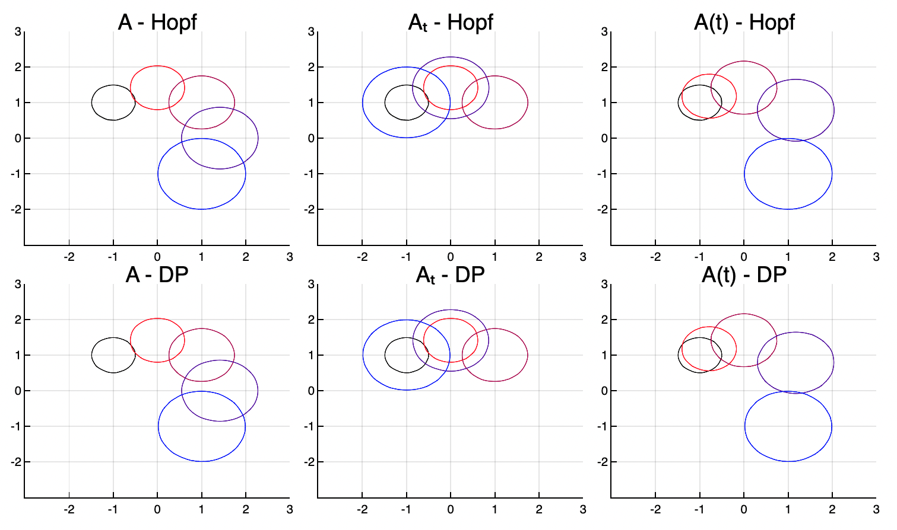

# HopfReachability.jl
Julia code for solving Hamilton-Jacobi reachability and optimal control of 2-player differential games via optimization of the Hopf cost. This method allows for solving the value function in a space-parallelizeable fashion that avoids the curse of dimensionality.

Note, in comparison with differential inclusions/zonotoping methods ([`ReachabilityAnalysis.jl`](https://github.com/JuliaReach/ReachabilityAnalysis.jl)), which overapproximate all reachable trajectories, Hamilton-Jacobi Reachability is based on assuming a differential game and yields the reachable set for an optimal controller despite any action of the disturbance. See [`hj_reachability.py`](https://github.com/StanfordASL/hj_reachability) or [`helperOC.m`](https://github.com/HJReachability/helperOC) for dynamic programming (dimension-sensitive) solutions to this problem.

### Associated Publications

[Algorithm for Overcoming the Curse of Dimensionality for State-dependent Hamilton-Jacobi equations](https://arxiv.org/pdf/1704.02524.pdf)

[Algorithms for Overcoming the Curse of Dimensionality for Certain Hamilton-Jacobi Equations Arising in Control Theory and Elsewhere](https://arxiv.org/pdf/1605.01799.pdf)

[Time-Optimal Collaborative Guidance Using the Generalized Hopf Formula](https://arxiv.org/pdf/1709.06590.pdf)

[Koopman-Hopf Hamilton-Jacobi Reachability and Control](https://arxiv.org/abs/2303.11590)

## 

Currently, this solution and algorithm are validated for,
- Linear Time-Varying Dynamics
- Convex Games (when non-convex, Hopf value is lower bound to true value)
- Differential Games with unique Nash Equilibria (min max = max min)

Beware, if the Hamiltonian is nonconvex, which occurs when the disturbance set exceeds the control set, then the Hopf objective is nonconvex and convergence to the global optimum is not guaranteed (nor agreement between minimax and viscosity solutions). In these settings, we reinitialize the optimization multiple times and in practice, we find that proximal methods converge to the global optimum within one or two guesses. Note, an erroneous value does not affect the solution at any other point (unless warm-starting).

Note, **this package and its algorithms are in the early stages of development**. The authors (Will Sharpless, Yat Tin Chow, Sylvia Herbert) welcome any criticism or discovery of bugs. If you are interested in helping, we have many ideas to advance this package and look forward to collaboration.

## Problem Formulation

Given a linear, time-varying system,
```math
\dot{x} = A(t)x + B_1(t) u + B_2(t) d
```
where control and disturbance are constrained to convex sets (ellipse/ball and box predefined, but any convex constraint allowed), e.g. 
```math
u \in \big\{ u \in \mathbb{R}^{n_u} \:\: | \:\: (u-c_u (t))^T Q^{-1}_u (t) (u-c_u (t)) \leq 1 \big\} \quad \& \quad d \in \big\{d \in \mathbb{R}^{n_d} \:\: | \:\: (d-c_d (t))^T Q^{-1}_d (t) (d-c_d (t)) \leq 1 \big\}
```
we will compute the Backwards Reachable Set for time T for which all points can be driven to the target with the optimal control despite the worst disturbance.

The target set is defined by an initial Value function $J(x)$ for a convex target set $\mathcal{T}$ such that,
```math
\begin{cases}
J(x) < 0 \:\: \text{ for } \:\:x \in \mathcal{T} \setminus \partial\mathcal{T} \\
J(x) = 0 \:\: \text{ for }\:\:x \in \partial\mathcal{T} \\
J(x) > 0 \:\: \text{ for } \:\:x \notin \mathcal{T}
\end{cases}
```
where $\partial \mathcal{T}$ is the boundary of $\mathcal{T}$. E.g. 

```math
\mathcal{T} := \big\{x \in \mathbb{R}^{n_x}  \:\: | \:\: (x - c_\mathcal{T})^T Q^{-1}_\mathcal{T} (x - c_\mathcal{T}) \le 1 \big\} \rightarrow J(x) = \frac{1}{2} \big((x - c_\mathcal{T})^T Q^{-1}_\mathcal{T} (x - c_\mathcal{T}) - 1 \big)
```

## Code Structure

- `Hopf_BRS`: fed a system, target and T, (optionally grid and optimization parameters) and makes a grid and performs optimization for points in the grid near the boundary of the target by calling,
- `Hopf_cd`/`Hopf_admm`: do the optimization (coordinate descent or the alternating method of multipliers) and reinitializes to find global optimum and calls,
- `Hopf`: evaluates the value of the Hopf formula for a given value of x and v.
- `Hopf_minT`: finds the minimum time such that a given state is reachable and returns the optimal control
- `plot_BRS`: will produce either scatter (fast) or contour (slow and sometimes misleading) plots, can do 2D or 3D, also can plot value function
- `preH`, `intH`, `HJoc`: utility fn's for precomputing, integrating with precomputed data, solving the optimal control respectivley

## Demo

Here we solve the Backwards Reachable Sets for three simple, time-varying systems with an elliptical target, inputs confined to the unit ball, and coordinate descent. Note, when solving the BRS, the value at each point is determined independently and then the zero-level set is interpolated after. The plot below shows the comparison with `hj_reachability.py`, a dynamic-programming method.

```
using LinearAlgebra, Plots
using .HopfReachability: Hopf_BRS, Hopf_admm_cd, Hopf_admm, Hopf_cd, intH_box, preH_box, intH_ball, preH_ball, plot_BRS, Hopf

## Time
th = 0.05
Th = 0.25
Tf = 1.0
T = collect(Th : Th : Tf)

## Initialize (2D Example)
max_u, max_d = 1.0, 0.5

A = -[0. float(pi); -float(pi) 0.]
At = [if s <= T[end]/2th; -A; else; A; end; for s=1:Int(T[end]/th)]
Af(s) = 2 * (Tf - s) * A

B₁, B₂ = [1. 0; 0 1], [1. 0; 0 1];
B₁t, B₂t = [[1. 0; 0 1] for s=1:Int(T[end]/th)], [[1. 0; 0 1] for s=1:Int(T[end]/th)];
B₁f(s), B₂f(s) = [1. 0; 0 1], [1. 0; 0 1];

inputshape = "Ball"
Q₁ = [1. 0; 0 1]; Q₂ = [1. 0; 0 1];
c₁ = [0. 0.]; c₂ = [0. 0.];

system   = (A, max_u * B₁, max_d * B₂, Q₁, Q₂, c₁, c₂)
system_t = (At, max_u * B₁, max_d * B₂, Q₁, Q₂, c₁, c₂)
system_f = (Af, s -> max_u * B₁f(s), s -> max_d * B₂f(s), Q₁, Q₂, c₁, c₂)

## Target: J(x) = 0 is the boundary of the target
Qₓ = diagm([1; 1])
cₓ = [-1.; 1.]
r = 1.0/2
J(x::Vector, Qₓ, cₓ) = ((x - cₓ)' * inv(Qₓ) * (x - cₓ))/2 - 0.5 * r^2 #don't need yet
Jˢ(v::Vector, Qₓ, cₓ) = (v' * Qₓ * v)/2 + cₓ'v + 0.5 * r^2
J(x::Matrix, Qₓ, cₓ) = diag((x .- cₓ)' * inv(Qₓ) * (x .- cₓ))/2 .- 0.5 * r^2
Jˢ(v::Matrix, Qₓ, cₓ) = diag(v' * Qₓ * v)/2 + (cₓ'v)' .+ 0.5 * r^2 #don't need yet
target = (J, Jˢ, (Qₓ, cₓ))

## Grid Definition (can be done automatically)
ϵ = 0.5e-7; res = 30; lbc, ubc = -3, 3; cg = zero(cₓ);
x1g = collect(cg[1] + lbc : (ubc-lbc)/(res-1) : cg[1] + ubc) .+ ϵ; lg1 = length(x1g); # == res, for comparing to DP
x2g = collect(cg[2] + lbc : (ubc-lbc)/(res-1) : cg[2] + ubc) .+ ϵ; lg2 = length(x2g);
Xg = hcat(collect.(Iterators.product(x1g, x2g))...);

## Hopf Coordinate-Descent Parameters (optional)
vh = 0.01; L = 5; tol = ϵ; lim = 500; lll = 5
max_runs = 3; max_its = 500
opt_p_cd = (vh, L, tol, lim, lll, max_runs, max_its)

solution, run_stats = Hopf_BRS(system, target, T; th, Xg, inputshape, opt_method=Hopf_cd, opt_p=opt_p_cd, warm=true, check_all=true, printing=true);
solution_t, run_stats = Hopf_BRS(system_t, target, T; th, Xg, inputshape, opt_p=opt_p_cd, warm=true, check_all=true, printing=true);
solution_f, run_stats = Hopf_BRS(system_f, target, T; th, Xg, inputshape, opt_method=Hopf_cd, opt_p=opt_p_cd, warm=true, check_all=true, printing=true);
```
outputs,
```
Precomputation, ...

Solving Backwards Reachable Set,
   for t=-0.25...
   for t=-0.5...
   for t=-0.75...
   for t=-1.0...
TOTAL TIME: 2.201028708 s
MEAN TIME[s] PER TIME POINT: Any[0.0011887127075, 0.0012586165625, 0.0013362251025, 0.0011615285425]
TOTAL POINTS PER TIME POINT: Any[400, 400, 400, 400]

Precomputation, ...
LTV System inputted, integrating Φ(t)... Success!

Solving Backwards Reachable Set,
   for t=-0.25...
   for t=-0.5...
   for t=-0.75...
   for t=-1.0...
TOTAL TIME: 1.90769075 s
MEAN TIME[s] PER TIME POINT: Any[0.00105372, 0.001231955, 0.00132280125, 0.00115475552]
TOTAL POINTS PER TIME POINT: Any[400, 400, 400, 400]

Precomputation, ...
LTV System inputted, integrating Φ(t)... Success!

Solving Backwards Reachable Set,
   for t=-0.25...
   for t=-0.5...
   for t=-0.75...
   for t=-1.0...
TOTAL TIME: 1.840429166 s
MEAN TIME[s] PER TIME POINT: Any[0.0008633332274999999, 0.0012236046875000002, 0.0014111030199999998, 0.0010980207275]
TOTAL POINTS PER TIME POINT: Any[400, 400, 400, 400]
1-element Vector{Plots.Plot{Plots.PlotlyJSBackend}}:
 Plot{Plots.PlotlyJSBackend() n=5}
```
Then we can use `PyCall` to solve the same problem with `hj_reachability.py` (see [HopfReachability_LTV_demo.jl](https://github.com/UCSD-SASLab/HopfReachability/blob/main/Examples/HopfReachability_LTV_demo.jl)) and `plot_BRS` to plot the solutions (target in black, t solutions in red -> blue),

<p align="center">
  
</p>

See the /Examples for more.

## Future Work

We will expand this toolbox to handle problems that include, 
- nonlinear systems (which require generalized Hopf formula which is harder to optimize and lacks guarantees)
- error analysis
- more types of built-in target and constraint geometries

On the solver side, we will build the ability to 
- refine the value function based on Lipschitz bounds
- utilize the other optimization methods (PDHG)
- autodiff the gradient for convex cases
- parallelize the grid solving
- readily call this toolbox from Python and Matlab

